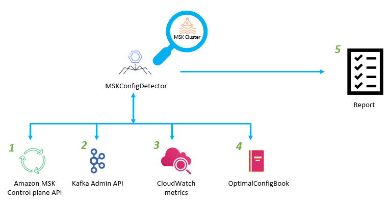
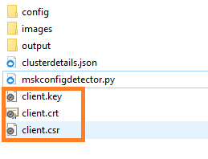

# MSKConfigDetector

MSKConfigDetector is a tool that analyzes your cluster configuration and makes recommendations based on the instance type, storage configuration and topic configuration. Using MSK best practices guideline, MSKDetector clearly indicates which configuration changes are necessary, taking into account factors such as instance type, local storage, tiered storage, segment size and retention period. Additionally, the tool can detect storage and partition imbalances on your cluster, and provide specific recommendations for correcting these imbalances.



## How the tool works

1. The MSKDetector uses the DescribeClusterV2 API of MSK to obtain the configuration details for a given cluster using its ARN. 
2. The MSKDetector uses the Kafka Admin API to obtain the configuration details for all the topics of a given cluster.
3. Using the CloudWatch getMetricData API, the MSKDetector retrieves metrics for the cluster.
4. The MSKDetector validates the recommended configuration for the specific cluster by comparing it with the current cluster configuration, using it’s OptimalConfigBook.
5. Based on the cluster's current configuration and the optimal configuration, the MSKDetector generates a best-practice recommendation report for the specific cluster.


## Prerequisite

You can execute the script from a client machine as long as you have network connectivity with you MSK cluster. The following prerequisites are required to use this tool:
 

1. Latest version of awscli
```
sudo yum update awscli
```

2. Python version 3.10.6 or higher

```
sudo yum install python3
```

2. Network connectivity between the client machine and MSK cluster’s VPC
3. AWS CLI configured with an IAM user which has  **AmazonMSKReadOnlyAccess** and **CloudWatchReadOnlyAccess** policy attached.
4. boto3 version 1.26.86 or higher

```
sudo yum install python3-pip

pip3 install boto3

```

5. install ssl

```
pip install ssl
```

6. Install kafka-python

```
pip install kafka-python
```

7. Operating system - Windows, Linux, MacOS


## Current features

1. The tool detects the broker type (m5.xlarge..), number of brokers, storage mode (local, provisioned, tiered), and the number of availability zones (AZs).
2. Based on the instance type, the tool recommends an appropriate provisioned throughput configuration.
3. Provides the current configuration of the cluster and provides recommendations for the following configurations based on the instance type and storage mode:
    1. num.io.threads
    2. num.network.threads
    3. remote.log.reader.threads
    4. log.segment.bytes
    5. num.replica.fetchers
4. Provides the current topic configuration for each topic and provides recommendations for the following configurations :
    1. replication factor
    2. segment.ms
    3. min.insync.replicas
    4. segment.bytes
5. Provides recommended per broker partition count and current partition count per broker to identify any partition imbalance.
6. Provides information about the disk usage per broker to identify any disk usage imbalance.
8. This tool is designed to work with MSK **provisioned** clusters and supports **PlainText** and **SASL/SCRAM** authentication.
7. Generates a report in the output directory.

## How to use the tool
1. Download this git repository on a client machine that has network connectivity with the VPC of the MSK cluster.
2. **Follow below steps if you are using SASL/SCRAM authentication for MSK**
* Install [Openssl](https://www.openssl.org/) 

* For Windows: download and install Openssl on your client machine: [Openssl](https://wiki.openssl.org/index.php/Binaries).

* For linux: 
```
sudo yum install openssl
```

* Generate a private key for the client:

```
openssl genrsa -out client.key 2048
```

* Generate a Certificate Signing Request (CSR) for the client. You'll be prompted to provide some information, such as the Common Name (CN), which should match the fully qualified domain name (FQDN) or IP address of the client. For **challenge password** - leave it empty:

```
openssl req -new -key client.key -out client.csr
```

* Send the CSR to a Certificate Authority (CA) for signing, or generate a self-signed certificate. If you're generating a self-signed certificate, you can use the following command:

```
openssl x509 -req -days 365 -in client.csr -signkey client.key -out client.crt
```

* Copy the client certificate (**client.crt**) and private key (**client.key**) to the amazon-msk-config-detector folder.



3. Open **clusterdetails.json**. Update your **clusterarn** and **region**. For authtype choose **PLAIN** or **SASL**. Update the user name and password if your authtype is SASL or leave it to default.

**Config for SASL/SCRAM**


**Config for plaintext**


4. Run the tool

```
python mskConfigDetector.py

```

5. Check the report in output directory.


## Sample report
[Sample Report](output/reportsample.txt)
